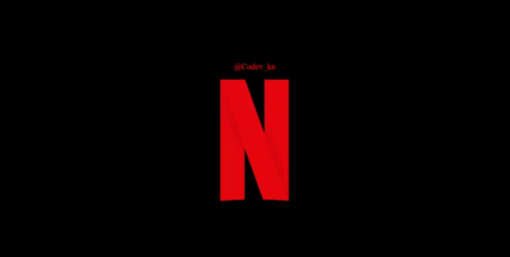

# Netflix Intro Recreation in HTML & CSS

Recreate the iconic Netflix intro animation using just HTML and CSS. Dive into the code to learn CSS animation techniques or add a nostalgic touch to your web projects.

## Demo

To experience the animation, simply open `index.html` in your web browser. You can also customize the animation by changing the letter "N" to any other letter ("E", "T", "F", "L", "I", or "X") directly in the HTML file.

## Credits

This project was inspired by the Netflix intro animation and was created with the help of CodePen.

## License

This project is currently not licensed.

## Feedback

Feedback and suggestions for improving the game are highly appreciated. Feel free to submit issues or reach out to the project maintainers with your insights and recommendations.

## Contact

For any questions or feedback, feel free to reach out on the following platforms:
- Facebook: [Codev](https://www.facebook.com/profile.php?id=61555707491922)
- Instagram: [Codev.](https://www.instagram.com/codev_kn)
- Twitter: [Codev_kn](https://twitter.com/Codev_kn)
- Threads: [codev_kn](https://www.threads.net/@codev_kn)
- TikTok: [codev_kn](https://tiktok.com/@codev_knd)

## Message For You

"Success is not final, failure is not fatal: It is the courage to continue that counts." - Winston Churchill

